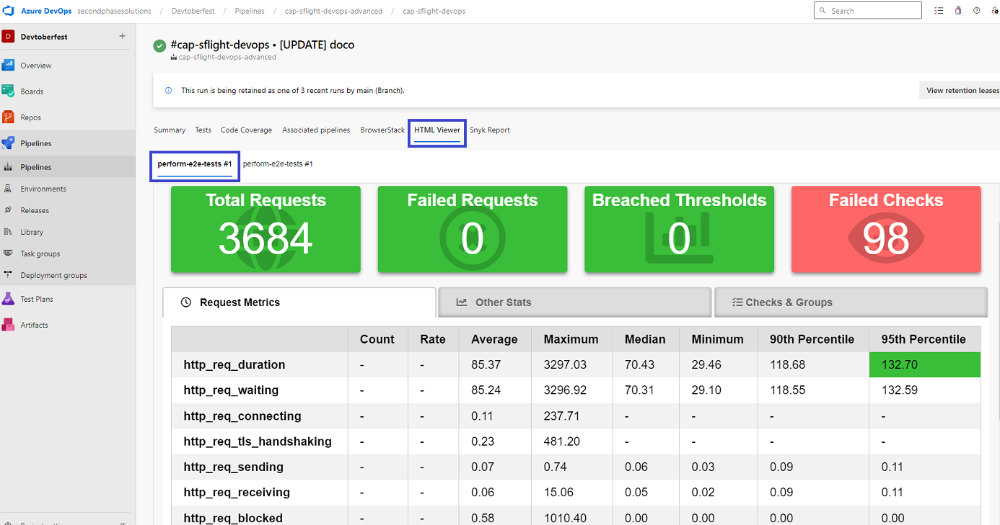

# Advanced Pipeline
- [Build](#build)
   - [Lint](#lint)
   - [Unit Tests](#unit-tests)
   - [Integration Tests](#integration-tests)
   - [Build MTAR](#build-mtar)
- [Deploy](#deploy)
- [Scan](#scan)
   - [Templates and conditional parameters](#templates-and-conditional-parameters)
   - [Snyk Security Scan](#snyk-security-scan)
- [E2E Tests](#e2e-tests)
   - [WDI5 BTP Workzone Tests](#wdi5-btp-workzone-tests)
   - [Browserstack Tests](#browserstack-tests)
   - [K6 Performance Tests](#k6-performance-tests)
- [Upload](#upload)
   - [Upload to CTMS](#upload-to-ctms)

*Hypothetical Scenario*:
The travel processing application is now in production and is being used by thousands of users. There are sporadic peak load times due to increased demand during holidays and special events. The development team understands the critical need for a robust and reliable CI/CD pipeline to maintain the application's performance and security.

1. **Quality Assurance**: this pipeline ensures code quality and security, reducing the likelihood of critical issues.
2. **Comprehensive Testing**: Extensive testing, including integration, security, end-to-end and performance checks, guarantees a robust application.
3. **Adaptability**: The pipeline is built using templates and conditional parameters. This design allows the team to easily modify or extend pipeline stages to accommodate evolving project requirements.
4. **Demonstration**: Developers can see the full CI/CD process in action, making it easier for new team members to learn and adapt.
5. **Reusable Template**: The pipeline serves as a reusable template for other projects within the enterprise, promoting consistency and best practices across the organization.


[azure-pipelines-advanced.yml](azure-pipelines\azure-pipelines-advanced.yml)


## Build
As mentioned before this repository builds on a copy of the [SAP-samples/cap-sflight](https://github.com/SAP-samples/cap-sflight) application, the repository already has working github actions, inside which is a [node.js.yml](.github/workflows/node.js.yml) which contains a steps i use in the BUILD stage


### Lint
The lint settings are as provided in the CAP-SFLIGHT sample

I see a lot of code in the wild that doesnt use linting, a bit of a pet hate, when i do a code review the first thing i normally do is check the lint, often the lint will return 1000s of issues, most of them very easy to fix, leaving just errors. Code that isnt linting is often very hard to reason with, that is hard to follow and find issues, abd creates a lot of unnecessary complexity, either the developer is unfamiliar with a language or framework, experimenting as they go, under tight deadlines and told not needed, or often have personal preferences and habits tht differ from the linting rules SAP CAP and or SAPUI5 provide (NIH not-invented-here).

* linting can improve the code quality and consistency by enforcing a common set of coding standards across the team and company, similar to SAP Code Inspector (SCI/ATC/SLIN etc) in ABAP , set up rules and ensure they adopted before code can be transported
* linting can reduce the number of errors or bugs by detecting and preventing syntax or logic errors, highlighting potential code smells and or security issues
* linting enhances the collaboration and communication among developers by providing, clear and concise feedback on changes, it failed cause you used tabs and not spaces
* including linting in a pipeline can save the time and resources which would other wise be need to review manually.

see [CDS Lint & ESLint](https://cap.cloud.sap/docs/tools/#cds-lint).  
**[Back to the Top](#advanced-pipeline)**

### Unit Tests
With unit tests

* You can isolate, and identify and fix bugs easily.
* You can improve the design and structure of your code and make it more readable and maintainable.
* You get instant feedback and visibility on the test outcomes and code quality metrics.

In the pipeline I used the exising unit tests from the copied application, to get the test results and code coverage to show in the pipeline run summary, I had to make a couple of small changes, I updated the [package.json](package.json) to ignore the wdi5 test files, different runner, and output the test results to the junit format, and for the code coverage gave some settings for acceptable coverage and where to put the coverage results.

```json
  // File: package.json
  "jest": {
    ...
    "modulePathIgnorePatterns": [
      "<rootDir>/azure-pipelines/e2e"
    ],
    "collectCoverage": true,
    "collectCoverageFrom": [
      "./srv/**"
    ],
    "coverageDirectory": "./test-results/coverage",
    "coverageThreshold": {
      "global": {
        "lines": 69,
        "functions": 59,
        "statements": -54
      }
    }
  },
  "jest-junit": {
    "suiteNameTemplate": "{filepath}",
    "outputDirectory": "./test-results/junit",
    "outputName": "TEST-cap_server.xml"
  },

```

in the pipeline yaml to [Review test results](https://learn.microsoft.com/en-us/azure/devops/pipelines/test/review-continuous-test-results-after-build?view=azure-devops)  
[PublishTestResults@2](https://learn.microsoft.com/en-us/azure/devops/pipelines/tasks/reference/publish-test-results-v2?view=azure-pipelines) - Publish test results v2 task was used.

```yaml
  # File: azure-pipelines/azure-pipelines-advanced.yml
  - task: PublishTestResults@2
    displayName: Publish Test Results
    inputs:
        testResultsFormat: "JUnit"
        testResultsFiles: "**/TEST-*.xml"
        mergeTestResults: false

```


[Review code coverage results](https://learn.microsoft.com/en-us/azure/devops/pipelines/test/review-code-coverage-results?view=azure-devops)

> Code coverage helps you determine the proportion of your project's code that is actually being tested by tests such as unit tests. To increase your confidence of the code changes, and guard effectively against bugs, your tests should exercise - or cover - a large proportion of your code.

[PublishCodeCoverageResults@1](https://learn.microsoft.com/en-us/azure/devops/pipelines/tasks/reference/publish-code-coverage-results-v1?view=azure-pipelines) - Publish code coverage task was used.

```yaml
  # File: azure-pipelines/azure-pipelines-advanced.yml
  - task: PublishCodeCoverageResults@1
    displayName: Publish Code Coverage Results
    inputs:
        codeCoverageTool: Cobertura
        summaryFileLocation: $(System.DefaultWorkingDirectory)/test-results/coverage/cobertura-coverage.xml

```


see [CDS Testing](https://cap.cloud.sap/docs/node.js/cds-test).  
**[Back to the Top](#advanced-pipeline)**
### Integration Tests

With integration tests

* You can verify that your code works as expected and meets the functional and non-functional requirements.
* You can get immediate feedback and visibility on the test outcomes and identify any issues or risks.
* You can automate the testing process and save time and resources.
* You can check that your code integrates well with other components and systems and does not cause any conflicts or errors.

In the pipeline i reused the exising OPA5 Karma tests, for both the applications i added the karma-coverage and karma-junit-reporter npm modules to both the applications.

```cli
npm install --prefix ./app/travel_processor karma-coverage karma-junit-reporter --save-dev  

```

And to get the output of the tests to be published into the test results and coverage results as mentioned above, in the [karma.conf.js](app/travel_processor/karma.conf.js) the reporters neededd to be added and the output to sent to the same directories as unit tests use. Note there is no custom code in the Fiori apps so no coverage results.

```js
// File: app/travel_processor/karma.conf.js
config.set({
  ..
  reporters: config.ci ? ['progress', 'junit', 'coverage'] : ["progress"],
  junitReporter: {
    outputDir: '"../../../../test-results/junit',
    outputFile: 'TEST-travel_processor.xml',
    suite: '',
    useBrowserName: true
  },
  coverageReporter: {
    type: 'html',
    dir: '../../../../test-results/coverage'
  },
  ..
});

```

  
see SAPUI5 [Test Automation](https://sapui5.hana.ondemand.com/#/topic/ae448243822448d8ba04b4784f4b09a0).  

**[Back to the Top](#advanced-pipeline)**
### Build MTAR

Added the mbt npm package to the project, could easily have added the command in the project. A simple command to use the mta-sqlite.yaml, used the new [@cap-js/sqlite](https://www.npmjs.com/package/@cap-js/sqlite), just didnt want the hassle of turning on and off HANA Cloud instance in the BTP free tier.


```sh
# package.json
"build:cf:sqlite": "cp mta-sqlite.yaml mta.yaml && mbt build && rm mta.yaml"
```

```sh
# File: azure-pipelines/azure-pipelines-advanced.yml
npm install mbt
npm run build:cf:sqlite

```

To share the MTAR file between stages see [Publish and download pipeline Artifacts](https://learn.microsoft.com/en-us/azure/devops/pipelines/artifacts/pipeline-artifacts?view=azure-devops&tabs=yaml)

```yaml
# File: azure-pipelines-advanced.yml
steps:
- publish: $(System.DefaultWorkingDirectory)/bin/WebApp
  artifact: WebApp

steps:
- download: current
  artifact: WebApp

```
**[Back to the Top](#advanced-pipeline)**
## Deploy

The deploy depends on the success of the build stage, it uses the SAP Piper cfcli docker image to give the pipeline the Cloud Foundry CLI capability needed for deploying. The following declares the container cfcli which points to the [ppiper/cf-cli](https://hub.docker.com/r/ppiper/cf-cli) docker image.

```yaml
# File: azure-pipelines/azure-pipelines-advanced.yml
containers:
  - container: cfcli
    image: "ppiper/cf-cli"
    options: --user 0:0 --privileged

```

Then in the deploy job the vmimage usses the cfcli container and the Cloud Foundry CLI is available to be used in a bash script.

```yaml
# File: azure-pipelines/azure-pipelines-advanced.yml
- stage: Deploy
  displayName: Deploy to DEV
  variables:
    - group: cloudfoundry-variables
  dependsOn:
    - Build
  jobs:
    - job: deploy
      pool:
        vmImage: "ubuntu-latest"
      container: cfcli
      steps:
        - checkout: none
        - download: current
          artifact: WebApp
        - bash: |
            cf login -u "$(CF-USER)" -p "$(CF-PASSWORD)" -a "$(CF-API)" -o "$(CF-ORG)" -s "$(CF-SPACE)"
            cf deploy $(Pipeline.Workspace)/WebApp/*.mtar -f
```

Note above the use of the **cloudfoundry-variables** variable group.

> Variable groups store values and secrets that you might want to be passed into a YAML pipeline or make available across multiple pipelines. You can share and use variable groups in multiple pipelines in the same project.

A number of variable groups have been created for the different values and secrets needed.


see [Add & use variable groups](https://learn.microsoft.com/en-us/azure/devops/pipelines/library/variable-groups?view=azure-devops&tabs=yaml).   
**[Back to the Top](#advanced-pipeline)**
### Scan

### Templates and conditional parameters

In this stage we introduce templates and conditional parameters.
Azure DevOps templates are a way of defining reusable content, logic, and parameters in YAML pipelines. They can help you speed up development, secure your pipeline, and avoid repeating the same code in multiple places.
You can use conditions to specify when a template, a stage, a job, or a step should run or not. Conditions are written as expressions in YAML pipelines.

```yaml
# File: templates/npm-steps.yml
parameters:
  - name: runTest
    type: boolean
    default: false

steps:
  - script: npm install
  - ${{ if eq(parameters.runTest, true) }}:
    - script: npm test

```

This template defines a parameter called runTest that is a boolean value and defaults to false. It also defines two steps that run npm install and npm test commands. The second step only runs if the parameter runTest is true.

```yaml
# File: azure-pipelines.yml
jobs:
  - job: Linux
    pool:
      vmImage: 'ubuntu-latest'
    steps:
      - template: templates/npm-steps.yml # Template reference
        parameters:
          runTest: true # Override the default value of the parameter

```

This YAML file uses the template with the parameter runTest set to true. This means that both steps in the template will run for the Linux job.  
See [Template usage reference](https://learn.microsoft.com/en-us/azure/devops/pipelines/process/templates?view=azure-devops&pivots=templates-includes)  
**[Back to the Top](#advanced-pipeline)**

### Snyk Security Scan
Snyk is a popular security platform and tool that specializes in identifying and mitigating security vulnerabilities and issues in software applications and their dependencies. It provides a comprehensive approach to security by focusing on open-source libraries and third-party components, helping organizations proactively manage and remediate vulnerabilities.

Snyk is one of many extensions that are available in the Azure Devops marketplace, easy to sing up for free and get a Snyk Api token needed to integrate a task in your pipeline.

Benefits of using such as tool -  
**Vulnerability Detection**: Identifies security vulnerabilities and issues within your code and dependencies.  
**Early Detection**: Scans code during development, catching vulnerabilities before they reach production.  
**Automatic Remediation**: Provides actionable steps to fix vulnerabilities and can even automate the remediation process.  
**Dependency Security**: Ensures the security of third-party dependencies and open-source libraries.  
**Compliance**: Helps maintain compliance with security standards and regulations.   
**Shift Left Security**: Integrates security earlier in the development process.  
**Continuous Monitoring**: Supports ongoing security monitoring as code changes are pushed.  
**Enhanced Security Awareness**: Increases security awareness among developers.  
**Improved Code Quality**: Addresses not just security but also code quality issues.  
**Customizable and Integratable**: This is common, the service can be tailored to specific enterprise needs and then integrated into CI/CD pipelines.  
**Cost Savings**: Prevents costly security breaches and downtime.  

The SnykSecurityScan task simple to use. See [Example of a Snyk task to test a node.js (npm)-based application](https://docs.snyk.io/integrations/snyk-ci-cd-integrations/azure-pipelines-integration/example-of-a-snyk-task-to-test-a-node.js-npm-based-application)

```yaml
# File: azure-pipelines/azure-pipelines-advanced.yml
  - stage: Scan
    displayName: Security Scan
    dependsOn:
      - Deploy
    jobs:
    - job: scan
      steps:
        - template: templates/steps/snykSecurityScan.yml
          parameters:
              runJob: variables['securityscan.enabled']
```

The Scan task is in a template found at [azure-pipelines/templates/steps/snykSecurityScan.yml](azure-pipelines/templates/steps/snykSecurityScan.yml)
```yaml
# File: azure-pipelines/templates/steps/snykSecurityScan.yml
parameters:
 - name: runJob
   type: string
   default: false

steps:
- task: SnykSecurityScan@1
  condition: eq(${{ parameters.runJob }}, 'true')
  inputs:
    serviceConnectionEndpoint: "Snyk API"  #Service Connection name in project settings
    testType: "app"
    monitorWhen: "never"
    failOnIssues: true
    projectName: "$(Build.Repository.Name)"
```

  
Register a service connection in the Project Settings and give it the Snyk API token you created.

  
Here is an example of a known vulnerability in scan results.  
**[Back to the Top](#advanced-pipeline)**

## E2E Tests

### WDI5 BTP Workzone Tests 

**[Back to the Top](#advanced-pipeline)**
### Browserstack Tests 
In this job we integrate BrowserStack to run our WDI5 BTP Workzone tests accross a variety of devices and browsers, eg Iphone, Android, Ipad etc.

[https://www.browserstack.com/](https://www.browserstack.com/) offers a free trial, which gives 100 minutes of automated browser testing, you can sign up and get an Access Key and Username.  
Go to the market place and find [BrowserStack Azure DevOps Extension](https://marketplace.visualstudio.com/items?itemName=browserstackcom.browserstack-vsts-extension) here you will find  the instructions [Integrate BrowserStack Automate with Azure Pipelines](https://www.browserstack.com/docs/automate/selenium/azure-pipelines).

The instructions show you step by step how create a service connection providing the Access Key and Username.


The instructions also guide you through using the two tasks they provide.  
**BrowserStackConfig@0** the configuration task, link to the service end point and provide the steps and environment variables necessary for running the [wdio.browserstack.conf.js](azure-pipelines/e2e/wdio.browserstack.conf.js) file.  
The following shows how to configure the wdio.conf.js to use [Browserstack Service](https://webdriver.io/docs/browserstack-service/).  
**BrowserStackResults@1** is used to show the "BrowserStack" run results.  
**PublishPipelineArtifact@1** is used to store the webdriver logs as an artifact of the pipeline run.

```yaml
# File: azure-pipelines/templates/steps/browserstack-test.yml
parameters:
 - name: scriptName         # the script to run
   type: string 
   default: ''
 - name: runJob             # run the job
   type: string
   default: false
jobs:
  - job: browserstack
    condition: eq(${{ parameters.runJob }}, 'true')
    steps:
      - task: BrowserStackConfig@0
        inputs:
          BrowserStackServiceEndPoint: "BrowserStack"  # The service connection we created
      - script: |
          npm install
          npm run ${{ parameters.scriptName }} 
        workingDirectory: $(System.DefaultWorkingDirectory)/azure-pipelines/e2e # where tests are
        env:
          wdi5_username: $(wdi5_username)     # needed to authenticate BTP
          wdi5_password: $(wdi5_password)     # needed to authenticate BTP
          BASE_URL: $(URL_LPD)
          BROWSERSTACK_BUILD_NAME: $(BROWSERSTACK_BUILD_NAME)
        displayName: "Run BrowserStack"

      - task: PublishPipelineArtifact@1  #save the logs 
        condition: succeededOrFailed() 
        inputs:
          targetPath: "$(System.DefaultWorkingDirectory)/e2e/logs"
          artifactType: "pipeline"
          artifactName: "logs"
        displayName: "Publish wdi5 logs"

      - task: BrowserStackResults@1  # report on tests
        condition:
        inputs:
          browserstackProduct: "automate"
```

Below you can see the run summary for WDI5 tests running the BTP Workzone Launchpad test across a large number of devices.


You can drill down and go directly to the browserstack and see a replay of the individual tests.   


**[Back to the Top](#advanced-pipeline)**
### K6 Performance Tests
This task runs k6 performance tests against the application deployed to the BTP Launchpad.

[k6](https://k6.io/) is a free and open-source testing tool for load and performance testing of APIs, microservices, and websites.

Why k6?
* k6 tests are written in JavaScript which means a familiar low barrier to entry for developers.
* k6 is open source, which means it is free to use and can be customized as needed. This can be particularly useful for small teams or individual developers who may not have the budget for a commercial performance testing tool like LoadRunner.
* k6 collects a wide range of performance metrics during testing, including response times, error rates, and resource utilization. These metrics can be used to identify performance issues and ensure that SLAs are being met.
* k6 allows developers to set thresholds for performance metrics. If a threshold is exceeded during testing, k6 can automatically fail the test, indicating that the SLA has not been met.
* k6 has integrations with a wide range of tools, including Grafana, InfluxDB, and Jenkins etc. This can make it easier to analyse and visualize test results and integrate into DevOps workflows.
* k6 has many converters, making it easy to convert existing JMeter, Postman, Swagger/OpenAPI and HAR files into k6 tests
* k6 is very lightweight which means it can be run from any location, by anyone, very handy for determine location based issues

The following provides comprehensive instructions [Load testing with Azure Pipelines](https://k6.io/blog/integrating-load-testing-with-azure-pipelines/) showing how to create simple k6 tests and run them in an Azure DevOps Pipeline.

To run go to the market place and find the [k6 Load Testing](https://marketplace.visualstudio.com/items?itemName=k6.k6-load-test) extension and get it.

Below is the template used to call the k6 script.  
**k6-load-test@0** task accepts a filename, in the pipeline it points to [capsflightLaunchpad.js](azure-pipelines/performance/capsflightLaunchpad.js) here the code is set to authenticate a user to use the BTP Launchpad and run load tests for 2 minutes ramping up and down to 10 virtual users. The code performs the creation of a Travel Process request and deletes it, In the code the URL and APPID need to point to your BTP Launchpad and the APPID the html5 repository gives your app.

``` yaml
# File: azure-pipelines/templates/steps/performance-test.yml
parameters:
 - name: filename
   type: string 
   default: ''
 - name: runJob
   type: string
   default: false
jobs:
  - job: k6loadtest
    condition: eq(${{ parameters.runJob }}, 'true')
    steps:
      - task: k6-load-test@0
        inputs:
          filename: ${{ parameters.filename }} # file with tests
        env:
          K6_USERNAME: $(K6_USERNAME)     # BTP Workzone User
          K6_PASSWORD: $(K6_PASSWORD)     # BTP Workzone Password

      - task: PublishHtmlReport@1         # Publisth the report
        condition: succeededOrFailed()
        inputs:
          reportDir: "$(System.DefaultWorkingDirectory)/result.html"
          tabName: "K6 Performance Results"
``` 

k6 code is very easy to write, below show how simulate the creation of a Travel request calling the BTP Workzone app using HTTP calls only .  
  

Below are is the k6 report in Pipeline run results.  
Note it performed 3684 requests, the fastest being 29.46 miliseconds, maximum was 3.2 seconds, 95% of all calls was an avaerage of 132.70 milliseconds.
 

**[Back to the Top](#advanced-pipeline)**
## Upload

### Upload to CTMS

This job allows you to integrate your Azure Devops pipeline with the SAP Cloud Transport Management Service (CTMS).
It uploads the Multi Target Application archive (mtar) created in the Build stage and then imports it into the tartget CTMS Nodes queue ready for import.

The benefits of including CTMS into your CI/CD pipeline.
* Enterprise-ready change and release management process
* Audit trail of changes and transports
* Separation of concerns between developers and operators

The prerequisites: 
* You have an instance of Cloud Transport Management 
* [Set Up the Environment to Transport Content Archives directly in an Application
](https://help.sap.com/docs/cloud-transport-management/sap-cloud-transport-management/set-up-environment-to-transport-content-archives-directly-in-application).    
This provides the Client_ID and CLIENT_SECRET values needed for calling the [TMS API file upload](https://api.sap.com/api/TMS_v2/path/FILE_UPLOAD_V2) service.


The following is the configuration block in the main pipeline. Set uploadToCtms.enabled to "true" to enable.
``` yaml
  # File: azure-pipelines/azure-pipelines-advanced.yml
  - stage: Upload
    displayName: Upload to TMS queue
    dependsOn:
      - E2E_tests
    variables:
      - group: ctms-variables
    jobs:
      - template: templates/jobs/uploadToCtms.yml
        parameters:
          runJob: variables['uploadToCtms.enabled']
          ctmsNode: QAS_MTA    #The Node you want the MTAR to be added to 
```
Above shares a variable group **ctms_variables** shown below.  
  


| KEY           | Value                                                                          |
|---------------|--------------------------------------------------------------------------------|
| CLIENT_ID     | comes from the **Service Instance Service Key**                                |
| CLIENT_SECRET | comes from the **Service Instance Service Key**                                |
| TMS_API       | https://transport-service-app-backend.ts.cfapps.\<region\>.hana.ondemand.com/v2  |
| TOKEN_URL     | https://\<myctmsinstance\>.authentication.\<region\>.hana.ondemand.com/oauth/token |

The pipeline calls a template [azure-pipelines/templates/jobs/uploadToCtms.yml](azure-pipelines/templates/jobs/uploadToCtms.yml) which downloads the MTAR artifact created in the build stage and uses it to call **TMS_API** authenticated using the **TOKEN_URL** with the **CLIENT_ID** and **CLIENT_SECRET** provided via the shared environment variables.

``` yaml
 # File: azure-pipelines/templates/jobs/uploadToCtms.yml
parameters:
  - name: ctmsNode #The node you want to load the *.mtar file
    type: string
    default: QAS_MTA
  - name: runJob #Run the job or not
    type: string
    default: true
jobs:
  - job: uploadToCtms
    condition: eq(${{ parameters.runJob }}, 'true')
    steps:
      - checkout: self
      - script: npm install
        displayName: NPM install
      - download: current
        artifact: WebApp
      - script: npm run ctmsupload
        workingDirectory: $(System.DefaultWorkingDirectory)/azure-pipelines/ctms
        env:
          TMS_API: $(TMS_API) #ctms-variables
          TOKEN_URL: $(TOKEN_URL) #ctms-variables
          CLIENT_ID: $(CLIENT_ID) #ctms-variables
          CLIENT_SECRET: $(CLIENT_SECRET) #ctms-variables
          CTMS_NODE: ${{ parameters.ctmsNode }} #The Node to upload
          USER_NAME: $(Build.RequestedForEmail) #Email address of the GIT committer
          DESCRIPTION: "$(Build.DefinitionName): $(Build.SourceVersionMessage)" #RepoName - GIT Message
          MTA_PATH: "$(Pipeline.Workspace)/WebApp" #Where to find the MTAR file
        displayName: Upload to CTMS
```


Job log shows 'Transport request 463 was created in Node QAS_MTA.  


QAS_MTA CTMS Node note the Transport Description is made up of the "pipeline name" and the "commit message" and the Owner is the person who made the commit.  
  
NOTE the Transport Description is the name of the project - and the git commit that triggered the build.


**[Back to the Top](#advanced-pipeline)**