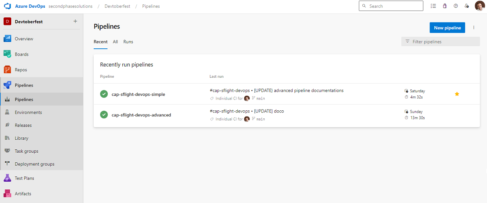

#cap sflight devops
# Welcome to the CAP SFLIGHT Azure Devops example repo

This repository is intended to be used a reference for how to create and run Azure Devops Pipelines on top of applications built with the [SAP Cloud Application Programming Model (CAP)](https://cap.cloud.sap).

The purpose of this sample app is to:
* Demonstrate how CI/CD Improves SAP CAP development with Faster Feedback, Quality, Risk, and Collaboration.
* Demonstrate what is possible to include in a pipeline.
* Demonstrate techniques to create templates for pipelines to be used across many projects.

This repository is a copy of the https://github.com/SAP-samples/cap-sflight  
The original [readme](README-sap-sample.md) ourlines all the features and benefits of that repository.

To make it easy to navigate and find all the additional configurations and developments they have been put into a the "azure pipelines" folder.
```
CAP-SFLIGHT-DEVOPS  
    ├── azure-pipelines/  
    │   ├── ctms 
    │   │   ├── ctmsUpload.js 
    │   │   └── package.json
    │   ├── docs  
    │   ├── e2e  
    │   │   ├── webapp \ test \ e2e
    │   │   │   └── Journey.test.js
    |   |   ├── wdio.conf.js
    |   |   ├── wdio.browserstack.conf.js
    |   |   └── package.json
    │   ├── performance 
    │   │       └── capsflightLaunchpad.js 
    │   ├── templates  
    │   │   ├── jobs  
    │   │   │   ├── browserstack-test.yml
    │   │   │   ├── performance-test.yml
    │   │   │   ├── uploadToCtms.yml
    │   │   │   └── wdi5-test.yml   
    │   │   └── steps  
    │   │       └── snykSecurityScan.yml
    │   ├── azure-pipelines-advanced.yml  
    │   └── azure-pipelines-simple.yml  
    ├── README.md  
    ├── README-simple-pipeline.md  
    └── README-advanced-pipeline.md  
```


The two main pipelines shared are:  
[Simple Pipeline](README-simple-pipeline.md)

[Advanced Pipeline ](README-advanced-pipeline.md)


