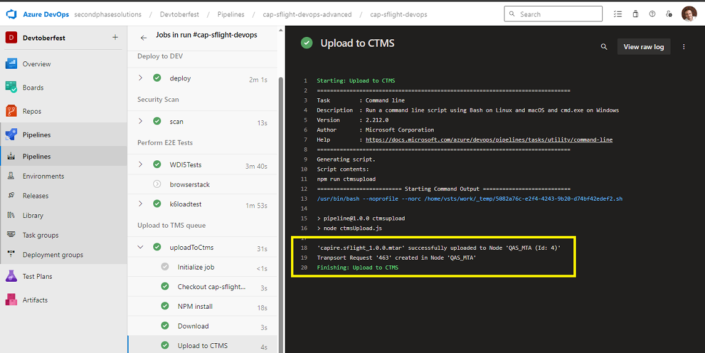
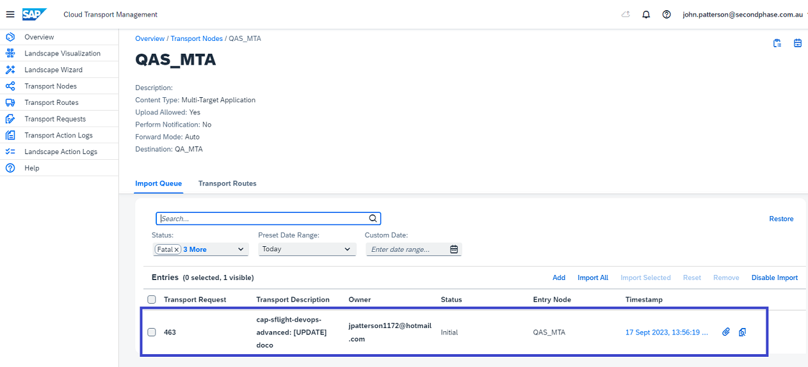

## UploadToCTMS
This job allows you to extend you Azure pipeline with the SAP Cloud Transport Management Service (CTMS).
It uploads the Multi Target Application (MTA) from the Build stage and then imports it into the tartget Nodes queue

``` yaml
parameters:
  - name: ctmsNode #The node you want to load the *.mtar file
    type: string
    default: QAS_MTA
  - name: runJob #Run the job or not
    type: string
    default: true
jobs:
  - job: uploadToCtms
    condition: eq(${{ parameters.runJob }}, 'true')
    steps:
      - checkout: self
      - script: npm install
        displayName: NPM install
      - download: current
        artifact: WebApp
      - script: npm run ctmsupload
        workingDirectory: $(System.DefaultWorkingDirectory)/azure-pipelines/ctms
        env:
          TMS_API: $(TMS_API) #ctms-variables
          TOKEN_URL: $(TOKEN_URL) #ctms-variables
          CLIENT_ID: $(CLIENT_ID) #ctms-variables
          CLIENT_SECRET: $(CLIENT_SECRET) #ctms-variables
          CTMS_NODE: ${{ parameters.ctmsNode }} #The Node to upload
          USER_NAME: $(Build.RequestedForEmail) #Email address of the GIT committer
          DESCRIPTION: "$(Build.DefinitionName): $(Build.SourceVersionMessage)" #RepoName - GIT Message
          MTA_PATH: "$(Pipeline.Workspace)/WebApp" #Where to find the MTAR file
        displayName: Upload to CTMS

```
The following sets the nodeId of where you want the MTAR to go
``` yaml
CTMS_NODE  
``` 

These environment variables need to be set
```
CLIENT_ID=***************************
CLIENT_SECRET=***************************
TMS_API=https://transport-service-app-backend.ts.cfapps.ap10.hana.ondemand.com/v2
TOKEN_URL=https://myctms.authentication.ap10.hana.ondemand.com/oauth/token
```
for further info on how to get them

SAPHELP for 
[creating-service-instance-and-service-key](https://help.sap.com/docs/cloud-transport-management/sap-cloud-transport-management/creating-service-instance-and-service-key])

API HUB [TMS API file upload](https://api.sap.com/api/TMS_v2/path/FILE_UPLOAD_V2)


Job log



File in QAS queue


note the Transport Description is the name of the project - and the git commit that triggered the build